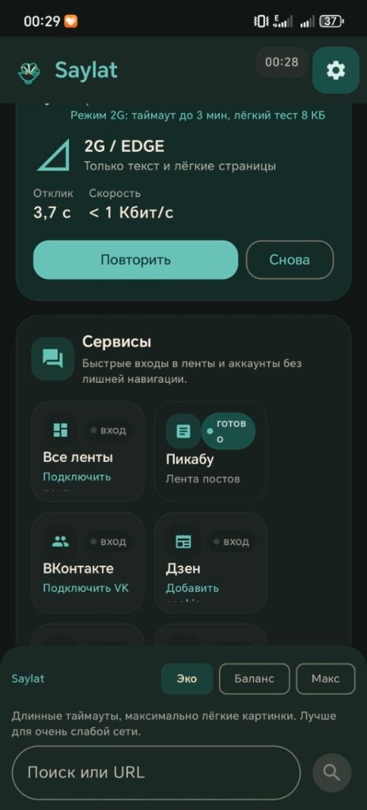
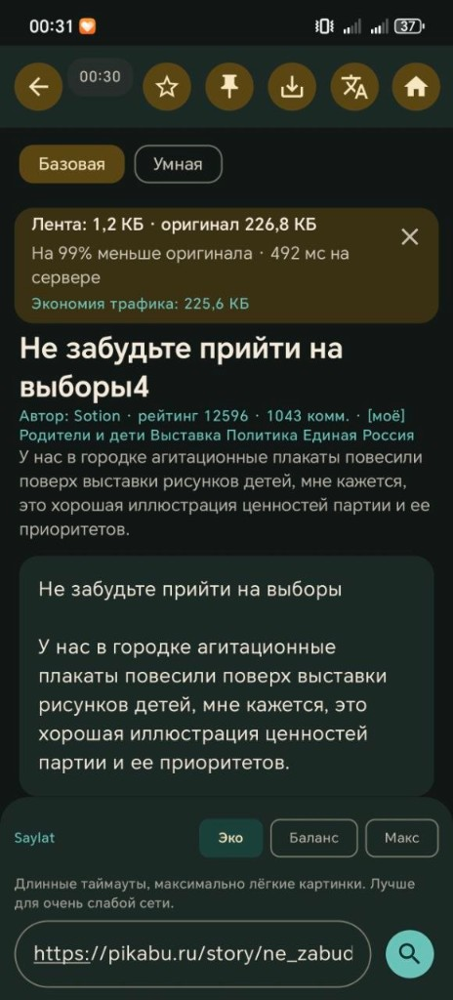
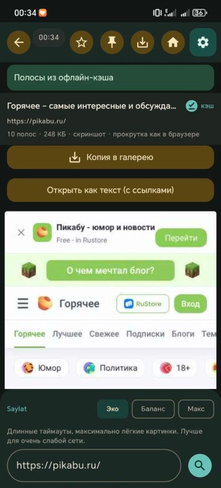
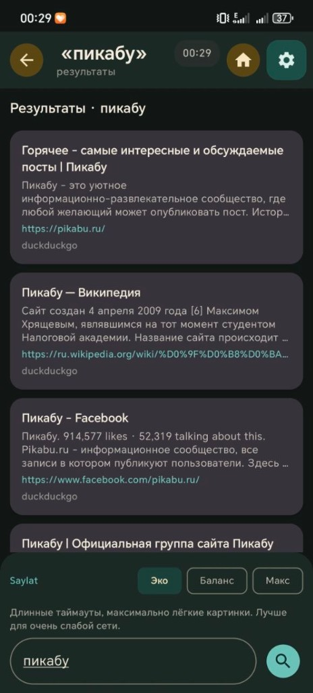
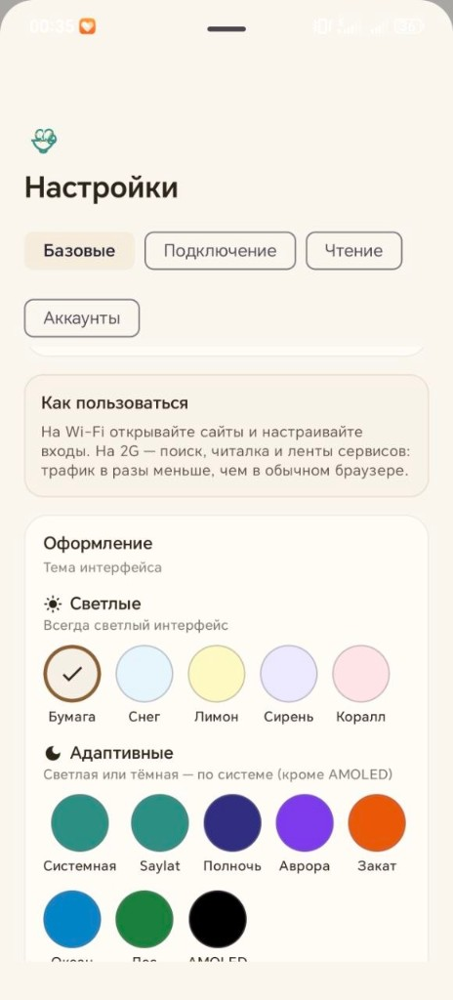

<p align="center">
  
</p>

# Saylat — браузер для слабого интернета (2G/EDGE)

[](https://github.com/Baddysays/Saylat/releases)
[](https://github.com/Baddysays/Saylat/actions/workflows/ci.yml)
[](https://github.com/Baddysays/Saylat/actions/workflows/release-apk.yml)
[](LICENSE)

**Легче салата** — сайт обрабатывается на **вашем сервере**, телефон получает сжатый и удобный контент.

Saylat для медленного интернета: сайты, Telegram, VK и почта — без лишних мегабайт.

*by **baddysays*** · [hello@baddysays.ru](mailto:hello@baddysays.ru) · [@baddysays](https://t.me/baddysays)

**Текущий релиз:** [0.5.58](https://github.com/Baddysays/Saylat/releases/tag/v0.5.58) (build 67) — [что нового](docs/CHANGELOG.md)

## Что это

Saylat — personal-first браузер и контент-хаб:

- VPS вытягивает страницу или ленту и сжимает payload (gzip / zstd / saylat-binary);
- Android показывает нативный экран без тяжёлого full-WebView по умолчанию;
- режимы **Light / Medium / Full**, STRIPS и умная вёрстка под слабый телефон;
- на 2G — progressive SSE, серверный TTS и экономия трафика с заголовком `X-Saylat-Savings`.

## Возможности

- **Три уровня сжатия** — Light для 2G, Full для быстрой сети
- **Тонкий браузер** — текстовый рендер + STRIPS (полосы скриншотов)
- **Progressive + delta** — ранний текст на 2G; повторное открытие статьи через ETag/delta
- **saylat-binary** — компактный бинарный wire-формат статей
- **Серверный TTS / подкаст** — озвучка через Edge TTS на VPS
- **Saylat** — пиксельный ёжик-тамагочи, пока страница грузится (можно отключить)
- **Telegram, VK, почта** — ленты через VPS (токены не в APK)
- **Офлайн-кэш** — недавно прочитанное на телефоне
- **Обновления** — APK с [GitHub Releases](https://github.com/Baddysays/Saylat/releases/latest)

## Быстрая установка

**Сервер (VPS или домашний ПК):**

```bash
curl -fsSL https://raw.githubusercontent.com/Baddysays/Saylat/main/scripts/install-saylat-server.sh | bash
```

**Телефон:**

1. [Скачать APK](https://github.com/Baddysays/Saylat/releases/latest) (`saylat.apk`)
2. При первом запуске указать сервер: `http://ВАШ_IP:8787`
3. На 2G/EDGE оставить **«Режим 2G»** включённым в настройках

## Личный сервер

Saylat — **ваш** прокси, а не общий хостинг.

| Шаг | Действие |
|-----|----------|
| Сервер | `install-saylat-server.sh` или `docker compose up -d --build` |
| Телефон | APK → URL сервера в настройках |
| Доступ | Закройте порт 8787 для чужих — см. [LICHNYI-SERVER.md](docs/LICHNYI-SERVER.md) |
| Деплой с Windows | `.\scripts\deploy-saylat-vps.ps1 -ServerHost "ваш.ip"` |

[Для пользователя](docs/DLYA-POLZOVATELYA.md) · [Сервер](docs/SERVER-SETUP.md) · [Мессенджеры](docs/MESSENGERS.md)

Публичный IP в git не кладём — только в `local.properties` / `.env` / `saylat.deploy.env` на вашей машине.

## Скриншоты

<p align="center">
  
  
  
</p>
<p align="center">
  
  
</p>

## Сайт

- [saylat.baddysays.ru](https://saylat.baddysays.ru) — лендинг (`website/v3`)

## Разработка

```bash
git clone https://github.com/Baddysays/Saylat.git
cd Saylat/server
python -m venv .venv && source .venv/bin/activate   # Windows: .\.venv\Scripts\Activate.ps1
pip install -r requirements.txt
cp .env.example .env
python run.py
```

```bash
# из корня
docker compose up -d --build
cd server && python -m pytest tests -q
cd android && ./gradlew testDebugUnitTest
```

Android: `android/local.properties.example` → `local.properties` (URL сервера и API-ключ опционально).

### Ключевые API

| Метод | Назначение |
|-------|------------|
| `GET /api/extract` | Статья (JSON / wire) |
| `GET /api/extract/binary` | saylat-binary / zstd / gzip |
| `GET /api/extract/delta` | ETag + бинарная дельта |
| `GET /api/extract/progressive` | SSE: meta → blocks → images |
| `GET /api/tts` | Озвучка статьи или текста |
| `GET|POST /api/podcast` | Подкаст из ленты или списка URL |
| `GET /api/traffic/stats` | Статистика экономии на сервере |
| `GET /health` | Статус прокси |

## Документация

| Документ | О чём |
|----------|--------|
| [docs/CHANGELOG.md](docs/CHANGELOG.md) | История версий |
| [docs/STRUCTURE.md](docs/STRUCTURE.md) | Структура репозитория |
| [docs/COMPRESSION_LEVELS.md](docs/COMPRESSION_LEVELS.md) | Light / Medium / Full |
| [docs/SERVER-SETUP.md](docs/SERVER-SETUP.md) | Установка и деплой VPS |
| [docs/ROADMAP.md](docs/ROADMAP.md) | Планы |
| [CONTRIBUTING.md](CONTRIBUTING.md) | Как помочь |
| [shared/article.schema.json](shared/article.schema.json) | Контракт API |

## Обратная связь

- [hello@baddysays.ru](mailto:hello@baddysays.ru)
- [@baddysays](https://t.me/baddysays)
- [Discussions](https://github.com/Baddysays/Saylat/discussions)
- [Issues](https://github.com/Baddysays/Saylat/issues)

## Лицензия

[MIT](LICENSE)
