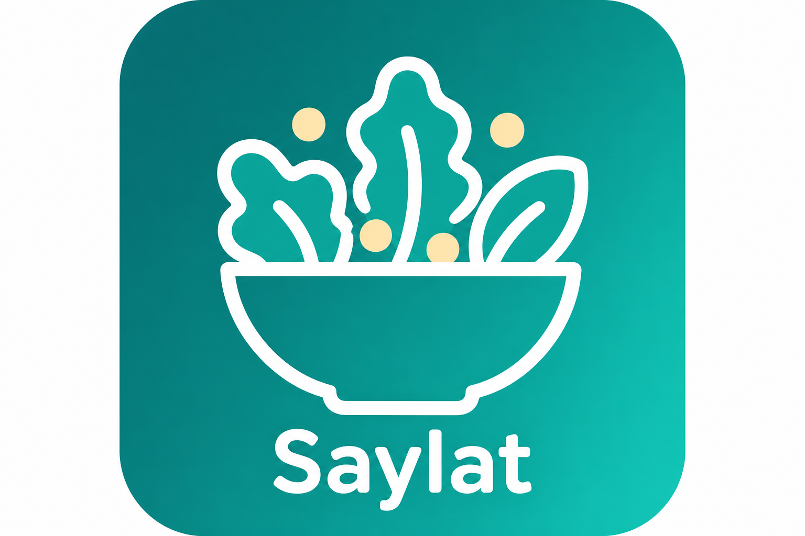
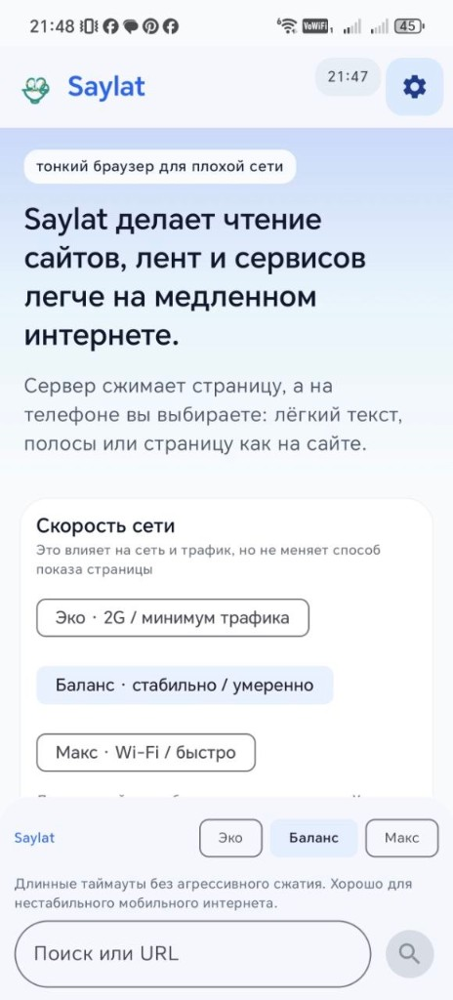
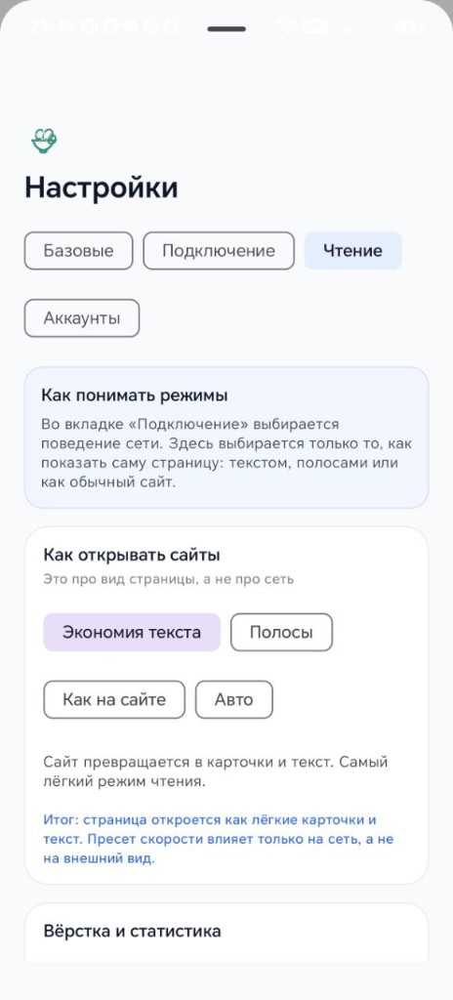
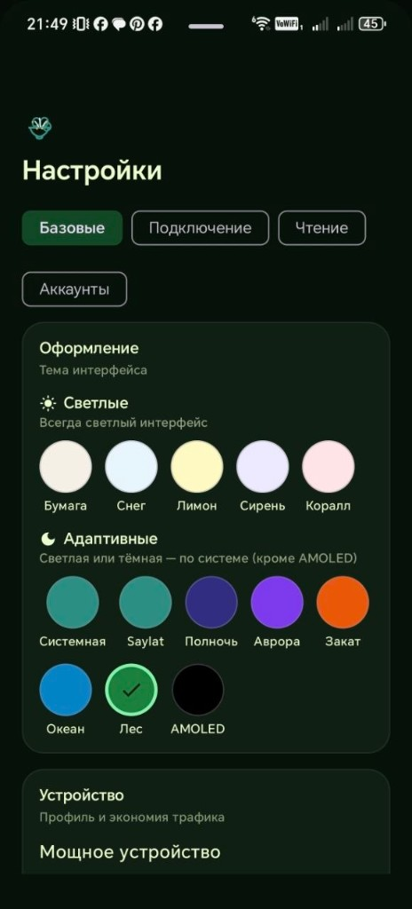

<p align="center">
  
</p>

# 🥗 Saylat — браузер и хаб для слабых сетей (2G/EDGE)

[](https://github.com/Baddysays/Saylat/releases)
[](https://github.com/Baddysays/Saylat/actions/workflows/ci.yml)
[](https://github.com/Baddysays/Saylat/actions/workflows/release-apk.yml)
[](LICENSE)

**Легче салата** — страницы сжимаются на **вашем прокси**, на телефоне удобный нативный экран без тяжёлого WebView.

Привет! 👋 Это проект для тех, у кого интернет медленный, а телефон хочется использовать по-настоящему: сайты, Telegram, VK и почта — без лишних мегабайт.

*by **baddysays*** · ✉️ [hello@baddysays.ru](mailto:hello@baddysays.ru) · 💬 [@baddysays](https://t.me/baddysays)

## 🚀 Возможности

- 📡 **Три уровня сжатия** (Light / Medium / Full) — подстраиваются под скорость сети
- 🌐 **Тонкий браузер** — статьи и полосы страниц через ваш сервер
- 💬 **Telegram, VK, почта** — ленты и ответы через VPS (токены не в APK)
- 📦 **Офлайн-кэш** — недавно прочитанное остаётся на телефоне
- 🔄 **Обновления** — APK только с [GitHub Releases](https://github.com/Baddysays/Saylat/releases) (`saylat.apk`)

## 🏠 Личный сервер (не публичный сервис)

Saylat — это **ваш** прокси на VPS или домашнем ПК, а не общий хостинг для всех.

| Шаг | Действие |
|-----|----------|
| 🖥️ Сервер | `curl -fsSL https://raw.githubusercontent.com/Baddysays/Saylat/main/scripts/install-saylat-server.sh \| bash` |
| 📱 Телефон | [Скачать APK](https://github.com/Baddysays/Saylat/releases/latest) → при первом запуске указать `http://ВАШ_IP:8787` |

📚 Подробнее: [для пользователя](docs/DLYA-POLZOVATELYA.md) · [сервер](docs/SERVER-SETUP.md) · [файрвол](docs/LICHNYI-SERVER.md) · [мессенджеры](docs/MESSENGERS.md)

Публичный IP в открытый git не кладём — только у вас в `local.properties` / `.env`.

## 📸 Как это выглядит

<p align="center">
  
  
  
</p>

## 🔧 Быстрый старт (для разработчиков)

```bash
git clone https://github.com/Baddysays/Saylat.git
cd Saylat/server
python -m venv .venv && source .venv/bin/activate   # Windows: .\.venv\Scripts\Activate.ps1
pip install -r requirements.txt
cp .env.example .env
python run.py
```

🐳 Docker из корня репозитория:

```bash
docker compose up -d --build
```

🤖 Android: папка `android/`, пример настроек — `android/local.properties.example`.

## 📖 Документация

| Документ | О чём |
|----------|--------|
| [docs/ROADMAP.md](docs/ROADMAP.md) | Планы и статус |
| [docs/REQUIREMENTS.md](docs/REQUIREMENTS.md) | Требования |
| [docs/COMPRESSION_LEVELS.md](docs/COMPRESSION_LEVELS.md) | Light / Medium / Full |
| [CONTRIBUTING.md](CONTRIBUTING.md) | Как помочь проекту |
| [shared/article.schema.json](shared/article.schema.json) | Контракт API |

## 🤝 Обратная связь

Будем рады любой помощи — от звезды ⭐ до кода.

- ✉️ Почта: [hello@baddysays.ru](mailto:hello@baddysays.ru)
- 💬 Telegram: [@baddysays](https://t.me/baddysays)
- 💬 [Discussions](https://github.com/Baddysays/Saylat/discussions) — [вопрос](https://github.com/Baddysays/Saylat/discussions/new?category=general) · [идея](https://github.com/Baddysays/Saylat/discussions/new?category=ideas) · [Q&A](https://github.com/Baddysays/Saylat/discussions/new?category=q-a)
- 🐛 [Issues](https://github.com/Baddysays/Saylat/issues) — ошибки
- 🔧 Pull request — см. [CONTRIBUTING.md](CONTRIBUTING.md)

## 📜 Лицензия

[MIT](LICENSE) · Copyright (c) 2026 baddysays
